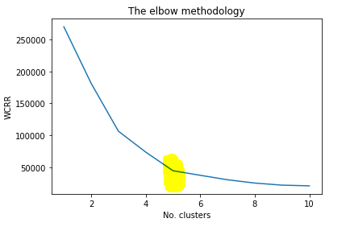
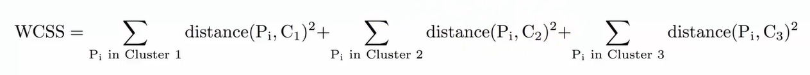
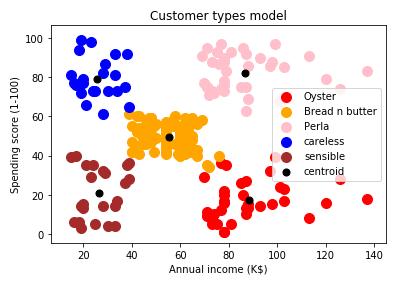

# Unsupervised-learning-k-means-model

## Find out the ideal number of customer types
From the result, as shown below, 5 cluster is the ideal number.

. 

The calculation is base on the WCSS, which measure the total of the square of the distance.

.

## Build the k-means clustering model (k = 5)
### Concerns
#### Random initialization trap
By using the k-means++ to avoid as a troubleshooting.

#### Distance algorithm
In this case, the distance is calculated by the Euclidian methodology.

### Result
The model assigned the data points into 5 clusters.
Cluster 1 is the customers who have high income and spend a lot, we called them Perla, the clients who each benefit the company the most.

Cluster 2 is the clients who have high income but does not spend much. These people need some efforts to exploit higher purchase, just like it hard to open an oyster.

Cluster 3 is the customers who have medium income and medium expense. These people are the average profit contributor to the company, just the bread, and butter in the breakfast.

Cluster 4 is the customers who have low income but high expense. They are the customers who do not care about the prices, so we call them careless type.

Cluster 5 is the opposite type to cluster 5. They have low income and low purchase. They are the people who are sensitive to the price.

## Conclusion
The K-means method successfully finds out the different types of customers base on the spending metric and their annual income. It could benefit the company to better label the customers and implement the different marketing strategies to drive more income and increase the customers' satisfaction. 
